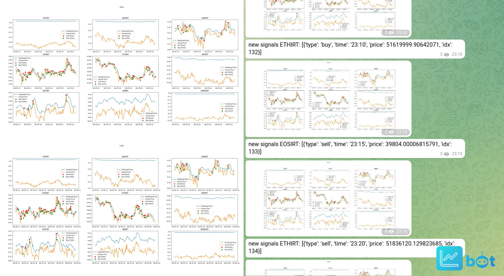

# Trader Bot
### An overview and implementation of a predicting and observing system for the cryptocurrency market

**Trader bot** is a personal project developed out of curiosity to challenge my skills and understanding of **Deep Learning** in a real-world project. The idea of trading bots is of the most controversial topics in today's world. Thanks to recent advancements in Artificial Intelligence and Deep Learning, we have observed successful examples of this technology in great tech companies. Consequently, to gain a vision around **stock market prediction** alongside combining my software engineering and Machine Learning skills, I started to study articles and develop this software. I found **LSTMs** suitable Neural Network model for the proposed task in this state. To gather our data for daily training of our models within the desired time frame, I used [Nobitex API](https://api.nobitex.ir/).

I trained a model for each of the currencies using the closed price in the last year. ( you can find trained models in the models' directory of the repository).

I used the over section of predicted price vs actual price as a signal where the actual price is above the predicted one is a buy signal and otherwise. In the end, the bot connects to a telegram channel, posts the predictions and the currencies chart, and if there were any signals, it would post them too. 

### Evaluation:
We can evaluate the profit gained by the system at the end of the runtime of the service. the `calculate_profit` function gets the log of signals gathered by system and returns profit resulted for each currency. Our system was successful to gain +2.52% profit at the end of 12 Augest 2022 which is promissing, but it needs further experiments and improvements.

System outputs in the telegram channel:

### TODO:
- [ ] Clean up the Jupyter notebook file.
- [ ] Decleare a JSON config file.
- [ ] Providing a documentation
- [ ] Experiment with Reinforcement Learning